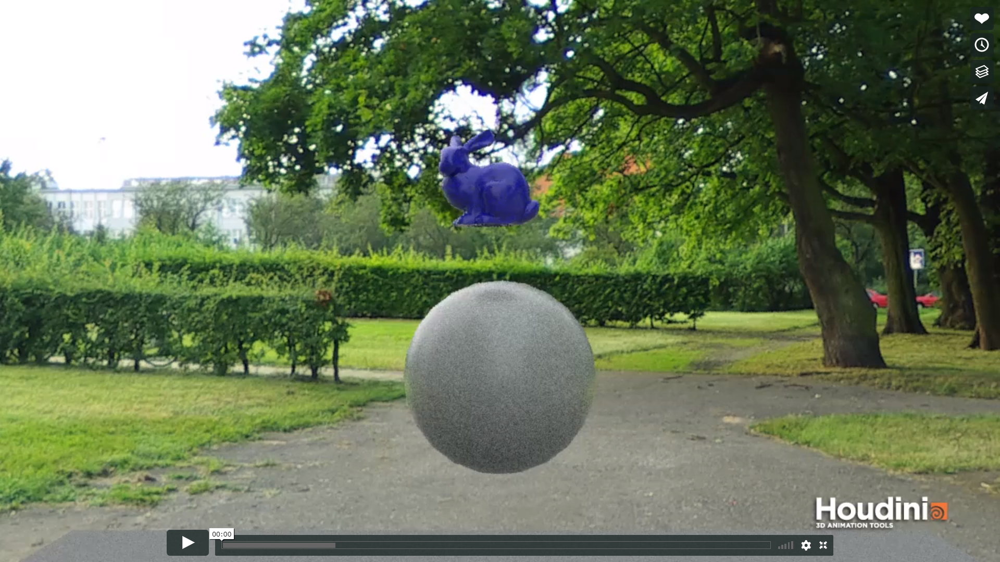

Jello Simulator using FEM
=========================

[](https://vimeo.com/235422890)

## Overview
This project implements a Jello Simulator using the Finite Element Method (FEM). The Finite Element method approximates the values of the unknowns (in this case, forces) at discrete points over the domain of the simulation. It does this by breaking down the problem into a number of really tiny simple problems, called finite elements. We treat these finite elements as their own systems that we solve individually to obtain a solution for the overall system. Because the finite element method uses approximations of the system at the discrete points its accuracy increase with smaller and smaller elements.

The simulator can actually represent a whole host of elastic materials by specifing their Densities, Young's Modulus and Poisson's Ratio; We have however set it up with values that represent Jello.

Our simulator is set up to create files (BGEO files) that can be rendered out in Houdini.

Refer to the file labeled "USAGE_INSTRUCTIONS" for how to use the Simulator.

#### Contributors
- [Aman Sachan](https://github.com/aman-sachan-asach)
- [Jonathan Lee](https://github.com/agentlee)
- [Rishabh Shah](https://github.com/rms13)
- [Jiongjian Chen](https://github.com/Groverc85)

#### Skip Forward to:
1. [Features](#Features)
2. [Implementation Overview](#Implementation)
3. [Algorithm Layout](#Algorithm)
4. [Architecture](#Architecture)
5. [Miscellaneous Demos](#Demo)
6. [Future Work](#Future)
7. [Limitations](#Limitations)
8. [Resources](#Resources)
9. [Credits](#Credits)

## Features <a name="Features"></a>
 - Finite Element Method with Fixed Corotated Elastic Model
 - Collisions with solid objects
 - Fixed point constraints
 - Scene creation and Rendering
 - Mass Distribution across discretised mesh
 - Explicit Forward Euler integration scheme
 - Data Driven Architecture that's easy to understand and extend
 - BGEO writing facilities
 - Obj to Poly file conversion utilities to make tetgen viable for meshes
 - Inter-Mesh Collisions (Work In Progress)

## Implementation Overview <a name="Implementation"></a>

[](https://vimeo.com/260037661)

The simulation works by applying forces to the individual vertices of that make up the mesh. These vertices exist through out the entire volume of the mesh and not just on it's surface. The forces are then used to update the velocities and then positions of the vertices in the Euler Integration Step. Because the vertices have changed positions the triangles that represent the surface of the mesh have also changed in size, shape, and position. This is what is seen as the elastic deformation that occurs on the model.

The forces that are applied to the mesh are both internal and external. The _external forces_ acting on a mesh are things like gravity or wind forces. These forces are applied in the same magnitude to all of the vertices that are exposed to those forces.
_Internal forces_ are the more interesting forces, as these are responsible for the elastic behaviour of the mesh. Basically, we assume that whatever shape the mesh starts off in is its default shape free of any deformation. And when the vertices change positions due to collisions, the changes in position are not uniform across the mesh. This results in deformation, a change of form of the mesh. We convert this deformation into forces that want to change the mesh back to an undeformed state.

So, far we have talked about the Mesh as a single system, but because we are using the Finite Element Method, we actually represent it as a bunch of tiny tetrahedrons, that are the finite elements. These tetrahedrons are the ones that have an initial undeformed state and undergo deformations as described above. The cummulation of all the tetrahedrons solves the bigger system that is the mesh.
The finer the tetrahedrons that make up the mesh the slower but also more accurate the resulting simulation will be.

### Algorithm Layout <a name="Algorithm"></a>

[](https://vimeo.com/260041318)

The algorithm can be broken down into a _Preprocess Step_ and an _Update Loop_.

#### Preprocess Step/Initialization

```
For every Mesh in the Simulation
{
   For every Tetrahedron that makes up that Mesh
   {
      compute the Rest Deformation for that tetrahedron
      compute the Inverse of the Rest Deformation for that tetrahedron
      compute the Undeformed Volume for that tetrahedron
      compute the product of (Undeformed Volume * Inverse Rest Deformation) for that tetrahedron --> Optimization Purposes
      
      compute the Distribution of Mass for that tetrahedron
   }
}
```

#### Simulation Update Loop

```
Update
{
   Clear Forces on all Vertices
   Recompute Mesh Attributes like triangle normals and bounding boxes
   Compute and Add External Forces for all Vertices
   Compute and Add Internal Forces for all Vertices
   Euler Integration For every Mesh in the Sim
   Collision Handling For every Mesh in the Sim
}
```

#### Elastic Force Calculation Loop

```
For every Mesh in the Simulation
{
   For every Tetrahedron that makes up that Mesh
   {
      Compute the New Deformation of that tetrahedron
      Compute the F Matrix for that tetrahedron
      Compute the P Matrix for that tetrahedron
      Compute the H Matrix for that tetrahedron
      
      The individual columns of the H Matrix represent the forces dues to deformation on the first 3 vertices of the tetrahedron.
      The Force on the fourth vertex = -(sum of forces on the other 3 vertices)
      
      Add forces to the individual vertices of that tetrahedron
   }
}
```

F can be thought of as the Transformation Matrix that converts the Undeformed tetrahedron into the Deformed Tetrahedron.

P is the Piola Kirchoff Stress Tensor that is a force computation model.

H is a matrix of Forces on the individual vertices.

#### Changing Parameters

[](https://vimeo.com/260041318)

### Collisions with rigid objects:

[](https://vimeo.com/260041595)

We represent the rigid objects in the scene as [Signed Distance Fields (SDF's)](https://cis700-procedural-graphics.github.io/files/implicit_surfaces_2_21_17.pdf). We can use SDF's to tell us how far away we are from a rigid body (or the ground). This means we can also tell when we are inside a rigid body. Our approach to making Elastic substances bounce off of rigid body objects is to simply set the velocity of the vertex that collided or even went inside a rigid body to zero. We essentially made it so that the vertex moves really slowly but in the same direction compared to the ones around it (the ones that didn't collided or intersect a rigid body). This leads to a deformation of that tetrahedron which leads to deformation forces that ripple through the entire mesh.

This is not physicall accurate but it is a nice approximation for the kind of artistic effect we wanted. It is also incredibly fast. The physically correct way to handle this would be to consider momentum transfer between the jello and the rigid body.

### Fixed Point Constraints:

[](https://vimeo.com/260161092)

Fixed Point Constraints are constraints that essentially just lock points (vertices in place). We create bounding volumes where ever we want the vertices to remain in place and then when updating the vertex's velocity, if the vertex lies inside the fixed region bounding box we set the velocity to zero. This ensures that the vertex's position doesn't move. 

### Detecting Collisions between Meshes:

To determine if we even have to perform intermesh collisions we check if the Axis Aligned Bounding Boxes of the meshes intersect. If they do then there are 2 cases we need to watch out for when doing Inter-Mesh Collisions namely Vertex moving through a Triangle and Triangle engulfing a Vertex.


#### Vertex moving through a Triangle

This is the standard case of a moving mesh colliding into anything. We loop through its vertices and perform triangle intersection tests to determine if the line traced by the vertex from its previous position to its current position intersects a triangle on a possibly colliding mesh.

#### Triangle engulfing a Vertex

In this test case the vertex remains at its current position and we move the triangle between its previous position and its urrent position. If we shoot a ray starting at the vertex, moving in the opposite direction of the velocity of the triangle. If it hits the triangle in its previous position, we shoot another ray. This second ray is shot starting from the vertex, moving in the direction of the velocity of the triangle. If this ray also hits the triangle in its current position, then we can assume that the vertex has been engulfed by the triangle.

### Resolving Collisions between Meshes (Work In Progress):

To resolve collisions we are trying a combination of position offsets and velocity changes for the vertex in question and the vertices of the triangle the vertex collides with.

## Architecture <a name="Architecture"></a>

We use a data-driven architecture for the simulation, and one of the most important things for that in terms of our code was creating structs/classes of arrays instead of arrays of structs. This means that there is an array of positions which stores all the positions of the vertices in a single array. Similarly, there are arrays for previous positions, velocities, forces, etc. The stark difference is easy to see when you know the alternate is having an array of Particles, where each Particle stores its position, its velocity, its previous position, its force, etc.

The reason our architecture is superior and will be faster then the alternative is because whenever we are working with vertices if we dont need all of the information of that particle then its useless loading the un-needed data in. In fact its worse than useless it actively slows down processing speeds. Consider this example:

Array of Struct, struct layout:
```
Vertex
{
   vec3 pos;
   vec3 vel;
   vec3 force;
   float mass;
}
```

So now if you perform an operation on vertices that only needs to use position data. If you didn't have data driven architecture, less vertex positions fit into cache because theyre spaced out by other data like vel, force, and mass. This also leads to more chache misses. It also leads to memory not being continuous and having to jump around to get the next position data. 

## Miscellaneous Demos <a name="Demo"></a>

#### Jello Cube

[](https://vimeo.com/260041318)

## Future Work <a name="Future"></a>
- Stable Inter-Mesh Collisions (Inter-Mesh Collisions is aa work in progress)
- Parallelization through CUDA so that you can run it on the GPU

## Limitations <a name="Limitations"></a>
 - Not energy conserving -- the mesh does not keep bouncing forever
 - Physics gets fudged a little during collisions (both with other ‘jello’ meshes and with sdf’s) - we don’t calculate momentum transfer but rely on deformation, velocity, and position changes to fix most things.

## Resources <a name="Resources"></a>
- http://run.usc.edu/femdefo/sifakis-courseNotes-TheoryAndDiscretization.pdf
- http://run.usc.edu/femdefo/barbic-courseNotes-modelReduction.pdf
- http://www.femdefo.org/
- http://www.math.ucla.edu/~jteran/papers/ITF04.pdf
- https://www.youtube.com/watch?v=BH1OrCtaPjo
- https://www.youtube.com/watch?v=SACGMSZx4FY&t=1s

## Credits <a name="Credits"></a>

- _Aman Sachan_ : Base code, bgeo writer, obj writer, inter-mesh collisions, most of the core algorithm, bug fixing and restructuring (lots of it);

- _Rishabh Shah_ : Base code, obj to poly converter for tetgen, tetgen, inter-mesh collisions, computation of piola-kirchhoff stress, bug fixing and restructuring (lots of it)

- _Jon Lee_ : Base code, SDF collisions, bgeo/obj writer debugging, creating and rendering interesting scenes

- _Jiongjian Chen_ : Symplectic Euler integration, Backward-Euler integration

